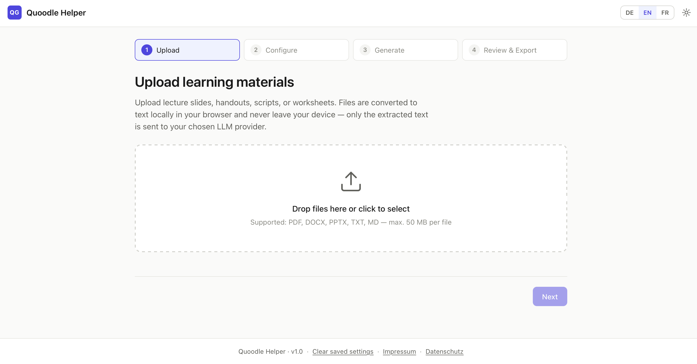

<!--
  Replace gerhi/quoodle-helper throughout this file with your actual GitHub path.
  Replace screenshots/quoodle-helper-*.png with real screenshots once you have them.
-->

[](https://github.com/gerhi/quoodle-helper/stargazers)
[](https://github.com/gerhi/quoodle-helper/network/members)
[](https://github.com/gerhi/quoodle-helper/issues)
[](LICENSE)
[](#privacy)
[](#supported-providers)
[](#privacy)

<h1 align="center">Quoodle Helper</h1>

<p align="center">
  Turn your lecture slides, handouts, and scripts into multiple-choice quizzes<br>
  — in your browser, from your own LLM key, ready for <a href="https://github.com/gerhi/quoodle">Quoodle</a>.<br>
  <br>
  <a href="#quick-start"><strong>Quick start »</strong></a>
  <br>
  <br>
  <a href="#features">Features</a>
  ·
  <a href="#supported-providers">Providers</a>
  ·
  <a href="#privacy">Privacy</a>
  ·
  <a href="#customizing-the-prompt">Prompt tuning</a>
  ·
  <a href="#related-projects">Quoodle</a>
</p>

---

## About Quoodle Helper

Quoodle Helper is a browser-based authoring tool for educators. Upload the
slides, handouts, scripts, or worksheets you already have, and get back a
ready-to-use multiple-choice quiz in an Excel file — with plausible
distractors, short explanations, and a format that drops straight into
[Quoodle](https://github.com/gerhi/quoodle).

It runs **entirely in your browser**. There is no server, no account, no
install. Your files never leave your device except as extracted text sent to
the LLM endpoint you choose — nothing else. It ships as a static folder that
you can deploy to the cheapest static host, serve from a university webspace,
or run offline from `file://`.

<br>

<p align="center">
  
</p>

---

## Features

### For educators

- 📚 **Upload what you already have** — PDF, DOCX, PPTX, TXT, MD (up to 50 MB per file). Text extraction runs in the browser.
- 🧠 **University-grade questions** — the default prompt targets *understanding*, not text recall: concept relationships, cause-and-effect, misconception-shaped distractors.
- ✍️ **Customizable prompt** — an advanced panel exposes the full system prompt for editing, persisted per browser. Add your subject area, house style, or exam format.
- 📊 **Excel export for Quoodle** — one row per question, columns line up with what [Quoodle](https://github.com/gerhi/quoodle) expects. Zero reformatting.
- 📥 **CSV export too** — UTF-8 with BOM, RFC 4180, round-trips cleanly through Excel, Calc, and Google Sheets.
- 🔑 **Bring your own key** — works with RWTH HPC, Anthropic, OpenAI, and any OpenAI-compatible endpoint including local Ollama.

### For the privacy-conscious

- 🚫 **No backend** — the repository is a static folder. There is nothing to log, cache, or leak.
- 🔒 **No analytics, no cookies** — only `localStorage`, only for user-chosen preferences.
- 🗂 **Files stay local** — extraction via `pdf.js`, `mammoth.js`, `JSZip` all in the browser. Only the extracted *text* goes to the LLM.
- 🗝 **Keys stay where you put them** — in memory by default, opt-in `localStorage` with a visible warning.
- 🌐 **Fully offline path** — point at a local Ollama server and nothing leaves your device.

### For everyone

- 🇩🇪🇬🇧 **German and English UI** — switchable at runtime, complete translations.
- 🧑‍⚖️ **German legal pages included** — ready-to-fill `impressum.html` and `datenschutz.html` per § 5 DDG and DSGVO Art. 13.
- 🎨 **Light, dark, and system themes** — with your OS preference as the default.
- ♿ **Keyboard-navigable** — all controls, all steps, all modals.

---

## Why Quoodle Helper

If you have ever sat down to write an exam from existing course material, you
know the work: 80% of the questions write themselves from the slides, but
someone still has to type them all out. Existing tools want an account, a
cloud upload, or a corporate subscription before you can even see the first
draft.

Quoodle Helper is the opposite. One educator. One folder of materials. One
LLM key of your choosing. A multiple-choice quiz Excel file, in two minutes,
that you can edit, trim, regenerate, or hand directly to Quoodle.

It is intentionally **not an LLM wrapper that hosts questions for you**: there
is no saved-quiz backend, no shared workspace, no user accounts. It generates,
you export, you own the file. If you want a hosted quiz service, use Quoodle
for the distribution side.

---

## Quick start

### Requirements

- A modern browser (Chrome, Edge, Firefox, or Safari — last two major versions).
- An API key for an LLM provider of your choice, or a running local Ollama.

That's it. No PHP, no Node, no Docker, no database, no build tools.

### Installation

**Option A — Run locally:**

```bash
git clone https://github.com/gerhi/quoodle-helper.git
cd quoodle-helper
python3 -m http.server 8000
```

Open `http://localhost:8000`. Everything needed (pdf.js, mammoth.js, JSZip,
SheetJS) ships in `vendor/` — no additional install step.

**Option B — Deploy to a static host:**

Upload the folder contents to GitHub Pages, Netlify, Vercel, a university
webspace, or any static host. No server runtime, no environment variables.

### Usage

1. **Upload** — drop your PDF, DOCX, PPTX, TXT, or MD files. Preview the extracted text if you want to sanity-check it.
2. **Configure** — pick a provider, paste your API key, set question count (1–100), difficulty, language, and style.
3. **Generate** — large sources are chunked automatically. The pipeline parses and validates the JSON response and deduplicates near-duplicate questions.
4. **Review & export** — scroll through the generated quiz, then download as `.xlsx` (for Quoodle) or `.csv`.

---

## Supported providers

The default is **Local / OpenAI-compatible**, pre-configured for the RWTH
Aachen HPC LLM service. You can point it at anything that speaks the OpenAI
chat-completions protocol.

| Provider | Default base URL | Default model | API key? |
|---|---|---|---|
| **Local / OpenAI-compatible** *(default)* | `https://llm.hpc.itc.rwth-aachen.de/v1/` | `openai/gpt-oss-120b` | yes |
| Anthropic Claude | `https://api.anthropic.com/v1/messages` | `claude-opus-4-5` | yes |
| OpenAI | `https://api.openai.com/v1/chat/completions` | `gpt-4o` | yes |
| Ollama (local) | `http://localhost:11434/v1/chat/completions` | `llama3.1:8b` | no |

URLs ending in `/v1` or `/v1/` automatically have `/chat/completions` appended,
so you can paste either form.

---

## Privacy

The privacy posture is not a marketing claim — it is baked into the
architecture. There is no backend, so there is nothing to promise and nothing
to breach.

| What lives where                                                   | Sent to your LLM provider | Stored in browser | Stored on a server |
|--------------------------------------------------------------------|:---:|:---:|:---:|
| Uploaded files (PDF, DOCX, PPTX …)                                 | ❌ never | only during the session | ❌ |
| Extracted text from files                                          | ✅ (that's the whole point) | only during the session | ❌ |
| Your API key                                                       | ✅ (as auth header) | only if you opt in | ❌ |
| Generated questions                                                | derived from | only during the session | ❌ |
| UI language, theme, provider choice, last-used options             | ❌ | `localStorage` | ❌ |
| Custom prompt (if edited)                                          | ✅ (it's the system prompt) | `localStorage` | ❌ |

Two cookies? No cookies. The app uses only `localStorage`, only for
user-chosen preferences. Every key is documented in `datenschutz.html`.

No third-party services are contacted during normal operation. No CDN fonts.
No analytics. No Sentry. No tracking pixels.

The GDPR-boilerplate pages (`impressum.html`, `datenschutz.html`) ship in
German only because they address German legal requirements; they contain
clearly marked placeholders (`[Name]`, `[Anschrift]`, `[E-Mail]`) for operator
contact details.

---

## Customizing the prompt

Under **Configure → Advanced: Base URL & Prompt** you can view and edit the
full system prompt that is sent to the model. Changes are persisted in
`localStorage` and restored on the next visit. A "Restore default" button
reverts to the shipped template.

The default template is deliberately tuned for university-level items:

- Forbids phrases like *"according to the text"* or *"laut Vorlesung"* — questions must stand on their own as domain questions.
- Pushes the model toward questions about **relationships between concepts** rather than text recall.
- Demands distractors of **comparable length and specificity** (the longest option should not be the correct one).
- Requires explanations that address the **strongest distractor**, not just restate the right answer.
- Enforces the **output language** with a concrete in-language example to anchor behavior.

Placeholders interpolated at request time:

| Placeholder | Replaced with |
|---|---|
| `{difficulty}` | `easy`, `medium`, `hard`, or `mixed` |
| `{difficulty_hint}` | One-sentence sub-instruction for that difficulty |
| `{style}` | `factual`, `conceptual`, `applied`, or `mixed` |
| `{style_hint}` | One-sentence sub-instruction for that style |
| `{output_language}` | `German`, `English`, or "the same language as the source material" |
| `{language_example}` | A full example question in the target language |

---

## Development

### Structure

```
quoodle-helper/
├── index.html              App shell (4-step wizard)
├── impressum.html          German legal notice (§ 5 DDG)
├── datenschutz.html        German privacy policy (GDPR / DSGVO)
├── download-vendor.sh      Refresh bundled libraries (macOS / Linux)
├── download-vendor.ps1     Refresh bundled libraries (Windows)
├── css/
│   ├── styles.css          Design system, light + dark + system
│   └── legal.css           Reading-focused style for legal pages
├── js/
│   ├── app.js              State, step navigation, event handlers
│   ├── i18n.js             DE / EN translation loader, t() / tp()
│   ├── extractors.js       PDF / DOCX / PPTX / TXT / MD → text
│   ├── providers.js        Unified LLM adapter, retries, timeouts
│   ├── generate.js         Prompt, chunking, JSON parse, dedupe
│   └── export.js           Excel (SheetJS) and CSV export
├── lang/
│   ├── de.json
│   └── en.json
├── vendor/                 Bundled JS libraries (pdf.js, mammoth, JSZip, SheetJS)
└── README.md
```

### Tech stack

| Layer | Choice |
|---|---|
| Runtime | The user's browser — no server, no Node |
| Module system | ES modules, dynamic import for pdf.js |
| File parsing | pdf.js, mammoth.js, JSZip + DOMParser for PPTX |
| LLM I/O | `fetch`, `AbortController`, exponential-backoff retries |
| UI | Vanilla JS, CSS custom properties, no framework, no build |
| Excel | SheetJS, in-browser `.xlsx` generation |
| Persistence | `localStorage` for preferences only |

### Adding a language

1. Copy `lang/de.json` to `lang/xx.json`, translate the strings.
2. Add `xx` to `SUPPORTED` in `js/i18n.js`.
3. Add a language switcher entry in `index.html`.
4. *(Optional)* Add a `{language_example}` entry in `js/generate.js` so the
   model gets an in-language example to anchor its output.

No build, no rebuild, no JSON manifest.

### Refreshing vendor libraries

The four JavaScript libraries under `vendor/` are pinned. To bump versions,
edit the version numbers at the top of `download-vendor.sh` (or the
PowerShell equivalent) and run the script:

```bash
# macOS / Linux
bash download-vendor.sh

# Windows
powershell -ExecutionPolicy Bypass -File download-vendor.ps1
```

### Requirements document

The full functional, security, and privacy requirements are in
[`quoodle-helper-requirements.md`](quoodle-helper-requirements.md) (in the
parent folder of the app if you downloaded the companion spec, or in
`docs/` if you added it to the repo).

---

## What Quoodle Helper is not

- It is **not a hosted quiz service**. There is no saved-quiz backend, no
  shared workspace, no user accounts. It generates, you export, you own the
  file.
- It is **not a replacement for your own judgement**. LLMs hallucinate. Every
  generated question should be read by you before it reaches a student. The
  review step exists for exactly that reason.
- It is **not an LLM provider**. You bring your own key. If you do not want to
  pay for API usage or deal with HPC quotas, this tool does not magic those
  costs away.
- It is **not a Quoodle replacement**. Quoodle runs the quiz; Quoodle Helper
  just prepares the questions. The two tools are companions.

If any of those disqualify it for you, that is the correct conclusion.

---

## Related projects

[**Quoodle**](https://github.com/gerhi/quoodle) is the *delivery* side:
upload the Excel file produced here, share a link and QR code with your
class, watch the aggregated statistics come in — all on cheap shared
hosting, no accounts, no tracking. Quoodle Helper is the *authoring* side.
Together they form a small, self-hosted toolchain for formative assessment,
both built around the same principles: **privacy by construction, zero
accounts, deployable to whatever you already have**.

---

## Acknowledgements

The design goals (privacy by construction, zero accounts, deployability to
whatever shared hosting or university webspace you already have) are shared
with [Quoodle](https://github.com/gerhi/quoodle).

Parts of this codebase were developed with the assistance of Anthropic's
Claude.

---

## License

Released under the [MIT License](LICENSE).

If you build on Quoodle Helper, please keep the privacy guarantees intact —
the whole point is that educators can use this on their own material without
worrying about who else reads it.
