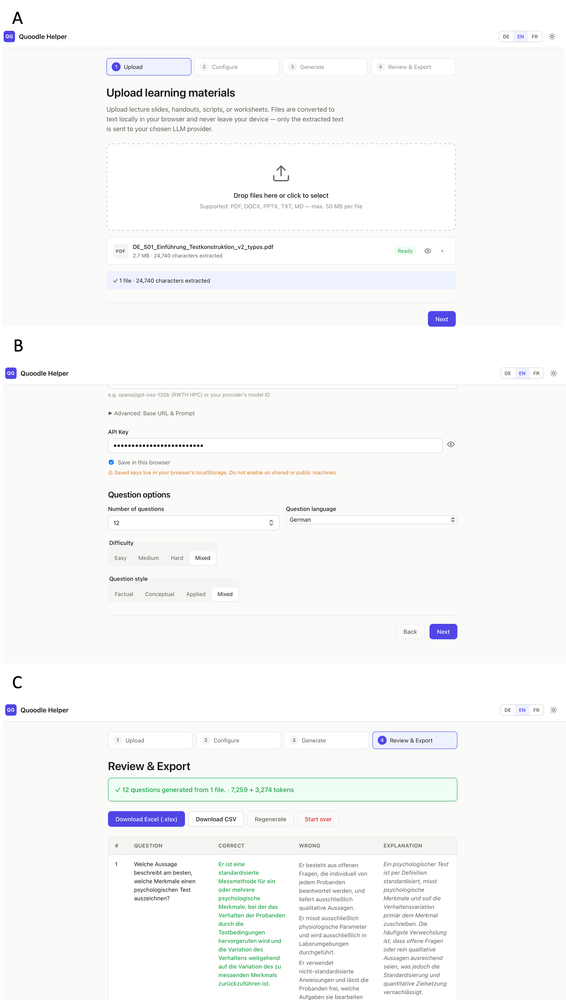

# Summary

`Quoodle Helper` is a fully client-side web application that aids the conversion of existing teaching materials — lecture slides, handouts, scripts, and notes in PDF, DOCX, PPTX, TXT, or Markdown format — into multiple-choice quizes. Text extraction runs entirely in the browser; only the extracted text is forwarded to a large language model (LLM) endpoint chosen and controlled by the educator. The resulting questions are exported as an Excel or CSV file that can be edited offline and can be used with [Quoodle](https://github.com/gerhi/quoodle) [@quoodle], the companion quiz-distribution tool for formative assessments. Together the two tools form a lightweight, self-hosted authoring-and-delivery pipeline for knowledge checks that requires no server infrastructure, no user accounts, and no third-party data processing beyond the LLM endpoint selected by the user.

# Statement of need

Short knowledge checks have well-documented learning benefits [@Hattie2007]. The easiest way to implement these are multiple-choice items. But it is still a time-intensive task to prepare them. Constructing distractors that are plausible without being misleading, and explanations that address the most tempting wrong answer rather than merely restating the correct one, usually demands subject knowledge and substantial editorial effort [@Haladyna2002]. The practical consequence is that many educators rely on a small, recycled item pool, or forgo formative quizzes altogether. 

Large language models have demonstrated the ability to produce exam-quality multiple-choice items from source texts and to match or exceed the discriminatory power of hand-written items in several subject domains [@Biancini2024]. Converting this capability into a tool that educators can actually adopt in the classroom, however, requires solving several further problems:

1. **Privacy and data protection.** Lecture slides and handouts can contain preliminary research findings, clinical vignettes, or examination blueprints that educators are not able or willing to upload to a commercial LLM, e.g. ChatGPT or Claude. EU institutions are additionally constrained by the General Data Protection Regulation and regional school-data-protection directives.
2. **Infrastructure and account friction.** Server-based tools require deployment, maintenance, and — almost universally — user accounts for both educator and learners.
3. **Vendor lock-in.** Tools tied to a single LLM provider inherit that provider's pricing, availability, and data-retention policies.
4. **Format incompatibility.** Generated items are typically delivered as formatted text that must be manually transferred into whichever quiz platform the educator uses, negating much of the time saving.

`Quoodle Helper` addresses each of these barriers. Because it is a static web application with no backend, it can be deployed on a university webspace, GitHub Pages, or a local development server with a single command. Because it accepts any OpenAI-compatible endpoint — including local inference servers such as Ollama and institutional HPC clusters — educators can choose a provider that matches their data-processing agreements. Because it exports directly to the spreadsheet format consumed by Quoodle [@quoodle], the path from source material to a live, feedback-rich quiz involves no manual reformatting.

# Pedagogical design

The default item-generation prompt of `Quoodle Helper` is tuned for university-level exam items that assess conceptual understanding and transfer rather than text recall [@Krathwohl2002]. Specifically, the prompt instructs the model to:

- Avoid phrasing such as "according to the text" or "laut Vorlesung" (according to the lecture), which anchor items to surface memory of the source rather than understanding of the concept.
- Prefer questions about **relationships between concepts** over questions about isolated definitions.
- Construct distractors of comparable length and grammatical form to the correct answer, and — where possible — target a specific, nameable misconception.
- Write explanations that address the most tempting wrong answer, not merely restate the correct one.

This prompt design is aligned with established item-writing guidelines for higher-education assessment [@Haladyna2002] and with the principle that elaborative feedback on incorrect responses produces larger gains than correctness-only feedback [@Shute2008]. All columns generated and exported by `Quoodle Helper` correspond directly to the input collumns expected by Quoodle, which displays the multiple choice test in a learning-friendly way.

Educators who work in specialised domains or who prefer a different assessment style can edit the system prompt through an **Advanced** panel in the configuration step. The edited prompt is stored locally in their browser so that this prompt can be re-used on subsequent visits; a single button reverts to the shipped template. This design gives educators direct control over item quality without requiring them to modify source code.

Difficulty and style are exposed as first-class parameters. The difficulty axis ranges from *easy* (factual recall) through *medium* (comprehension) to *hard* (analysis and evaluation), and the style axis covers *factual*, *conceptual*, and *applied* variants. Both parameters are interpolated into the system prompt at request time via named placeholders, so the model receives a single, coherent instruction set rather than a patchwork of conditional clauses.

# Implementation

`Quoodle Helper` is a static single-directory application with no build step and no server-side runtime. It is structured as a four-step wizard (`index.html`) backed by six focused JavaScript modules:

- **`extractors.js`** — converts uploaded files to plain text entirely in the browser, using `pdf.js` for PDF, `mammoth.js` for DOCX, and `JSZip` for PPTX slide text and speaker notes.
- **`providers.js`** — a unified adapter that targets any OpenAI-compatible endpoint, the native Anthropic Claude API, and direct OpenAI access. URL normalisation (appending `/chat/completions` when the base URL ends in `/v1`) means users can paste either form of a provider address.
- **`generate.js`** — handles prompt assembly, source-text chunking for large documents, JSON parsing and schema validation of model responses, and near-duplicate deduplication via normalised string comparison.
- **`export.js`** — produces the output file via SheetJS: one worksheet named `Questions`, with a bold header row and one question per subsequent row, in the column order (`Question`, `Correct Answer`, `Wrong 1`, `Wrong 2`, `Wrong 3`, `Explanation`, `Source`) that Quoodle's upload parser expects.
- **`i18n.js`** — loads a flat JSON translation map for German or English and applies it to all `data-i18n` attributes in the DOM; the active language is persisted in `localStorage` and switchable at runtime without a page reload.
- **`app.js`** — orchestrates step navigation, event handling, and application state.

All four browser libraries on which the application depends (`pdf.js` 4.7.76, `mammoth.js` 1.9.0, `JSZip` 3.10.1, and `SheetJS` 0.18.5) are bundled under `vendor/` and served from the server. The application makes no CDN calls, no analytics requests, and no calls to any endpoint other than the LLM provider the educator has explicitly configured. This ensures compliance with strict content-security policies and allows the tool to operate completely offline when paired with a local LLM-server such as Ollama.

API keys are stored in the browser storage (`localStorage`) with a visible warning displayed on the configuration screen. The repository ships with a German Impressum and Datenschutzerklärung (privacy policy) in accordance with § 5 DDG and the GDPR, with named placeholders indicating where a self-hosting educator should insert their own contact details.

The supported LLM providers and their defaults are listed in Table 1.

| Provider | Default base URL | Default model | API key required |
|---|---|---|---|
| Ollama | `http://localhost:11434/v1/chat/completions` | `llama3.1:8b` | no |
| Anthropic Claude | `https://api.anthropic.com/v1/messages` | `claude-opus-4-5` | yes |
| OpenAI | `https://api.openai.com/v1/chat/completions` | `gpt-4o` | yes |
| Local / OpenAI-compatible *(default)* | `https://llm.hpc.itc.rwth-aachen.de/v1/` | `openai/gpt-oss-120b` | yes |

Table: Supported LLM providers and their default configuration.

The source code is available at [https://github.com/gerhi/quoodle-helper](https://github.com/gerhi/quoodle-helper). 

# Acknowledgements

This project is a companion to Quoodle [@quoodle]. Large parts of the codebase were drafted with the assistance of Anthropic's Claude, under human design direction, review and verification.

# References
